# FISCO BCOS Wallet 使用教程

`FISCO BCOS Wallet` 是一款面向 FISCO BCOS 的浏览器插件钱包。用户可以用它创建或恢复钱包、管理账户和网络、连接 DApp，并在本地确认和签名交易。

## 1. 安装钱包

1. 打开 Chrome、Edge 或其他 Chromium 浏览器。
2. 进入扩展管理页面：

```text
chrome://extensions/
```
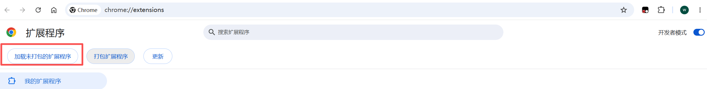
3. 开启“开发者模式”。
4. 点击“加载未打包的扩展程序”。
5. 选择钱包目录：

```text
例如：C:\fisco-bcos-wallet\dist
```
<div style="max-width: 414px; margin: 0 auto;">
  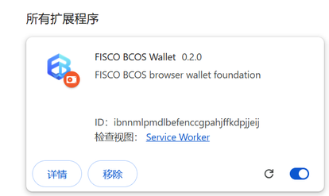
</div>
6. 浏览器右上角出现 `FISCO BCOS Wallet` 图标后，说明安装成功。

## 2. 创建或恢复钱包

第一次打开插件时会显示“管理你的链上账户”页面。可以创建新的助记词钱包，也可以使用已有助记词恢复钱包。

<div style="max-width: 414px; margin: 0 auto;">
  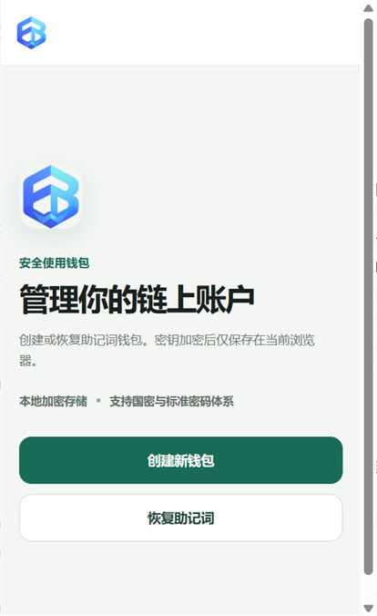
</div>

### 创建新钱包

1. 点击“创建新钱包”。
2. 填写钱包名称。
3. 选择生成 `12 词`或 `24 词`助记词。
4. 设置钱包密码并再次确认。密码至少需要 10 个字符，仅用于解锁当前浏览器中的本地钱包。
5. 点击“生成钱包”。

<div style="max-width: 414px; margin: 0 auto;">
  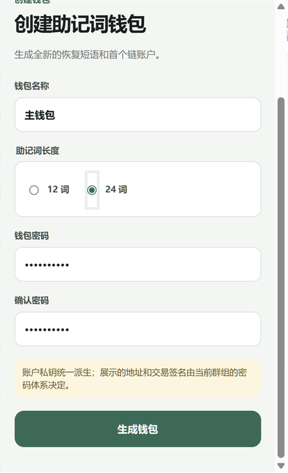
</div>

钱包生成后会进入“抄写恢复短语”页面。请按照编号离线抄写助记词，确认顺序正确后点击“我已安全保存”。

<div style="max-width: 414px; margin: 0 auto;">
  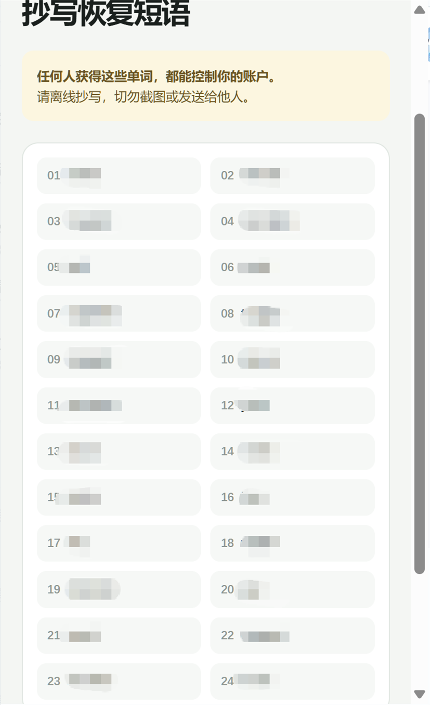
</div>

钱包会随机要求填写若干指定位置的单词。根据离线备份填写，点击“完成验证”。验证成功后进入钱包首页。

<div style="max-width: 414px; margin: 0 auto;">
  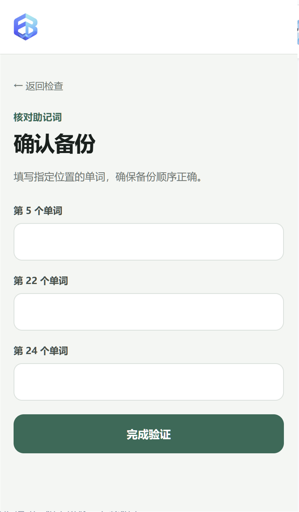
</div>

助记词验证成功后会进入到主界面。

<div style="max-width: 414px; margin: 0 auto;">
  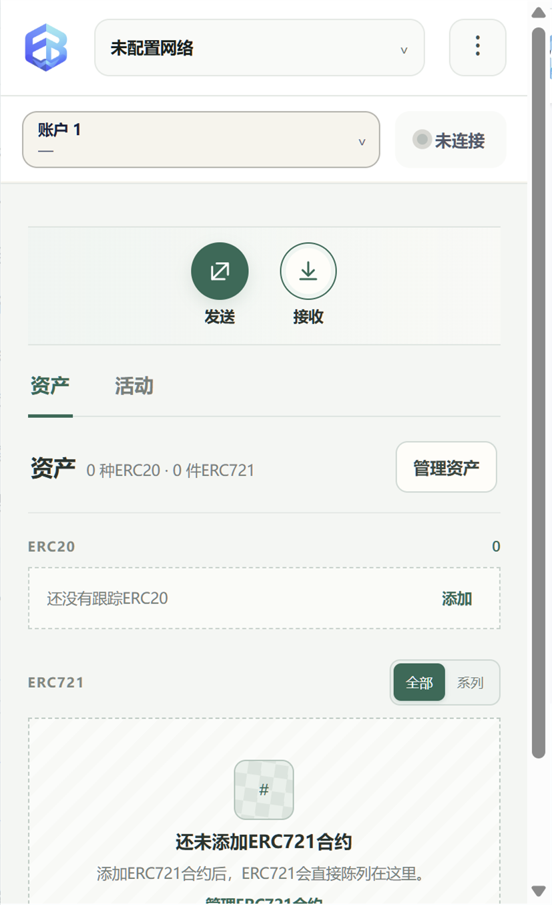
</div>

### 恢复已有钱包

1. 点击“恢复助记词”。
2. 填写钱包名称。
3. 按原顺序输入 `12` 或 `24` 个英文单词，以空格分隔。
4. 设置至少 10 个字符的新钱包密码并再次确认。
5. 点击“恢复钱包”。恢复成功后，钱包会重新派生链账户并进入首页。


<div style="max-width: 414px; margin: 0 auto;">
  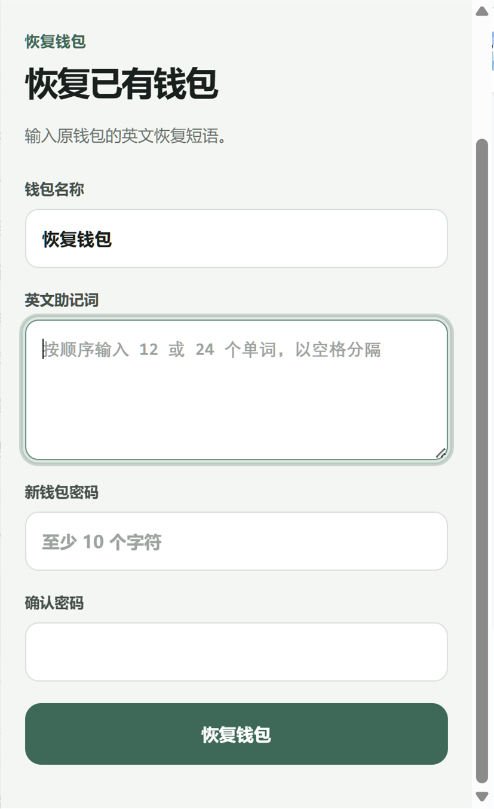
</div>

安全提示：

- 助记词和私钥只保存在本地。
- 助记词泄露后，任何人都可以控制账户。
- 不要截图、上传或发送助记词。
- 忘记密码后只能重置本地钱包，无法找回助记词。

## 3. 添加网络

钱包需要先配置网络，才能连接 DApp、读取链信息或发送交易。

在钱包首页点击顶部的“未配置网络”，再点击“管理网络”进入网络管理页面。


<div style="max-width: 414px; margin: 0 auto;">
  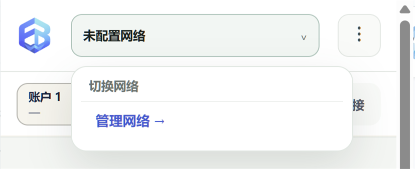
</div>

进入钱包的“网络管理”页面，点击“添加网络”，填写以下信息：

| 字段 | 说明 |
| --- | --- |
| 名称 | 自定义网络名称 |
| URL | 网络 RPC 地址 |
| RPC 类型 | 选择原生 RPC 或 Web3 RPC |
| 群组 ID | FISCO BCOS group ID |
| 密码体系 | 标准 `secp256k1` 或国密 `SM2 / SM3` |
| 开启余额 | 是否显示账户余额 |


确认 URL、群组 ID、RPC 类型和密码体系无误后，点击“验证并添加网络”。


<div style="max-width: 414px; margin: 0 auto;">
  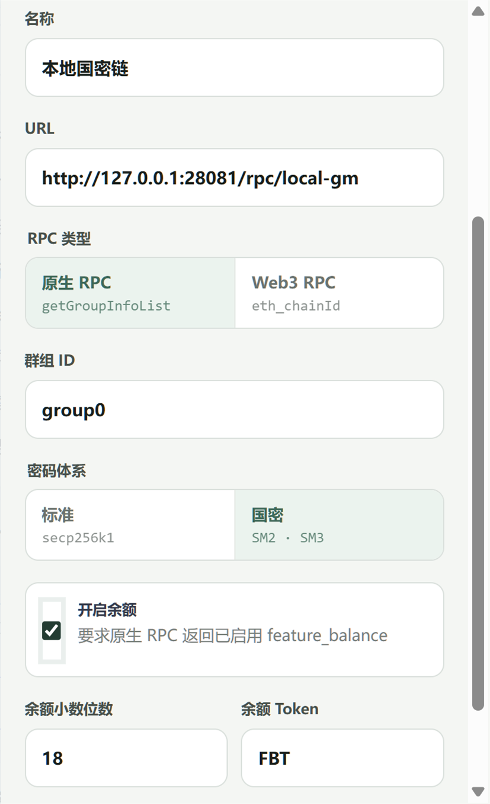
</div>

验证成功后，该网络会保存并成为当前网络。可以返回网络管理页面继续添加更多网络。


<div style="max-width: 414px; margin: 0 auto;">
  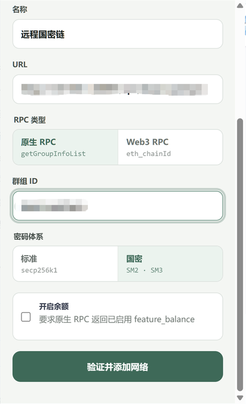
</div>

## 4. 切换网络

在钱包首页顶部可以查看当前网络。

如果需要切换网络：

1. 点击当前网络名称。

2. 进入网络列表。

3. 在“本地国密链”和“远程国密链”之间选择目标网络。

4. 返回首页确认网络已切换。

<div style="max-width: 414px; margin: 0 auto;">
  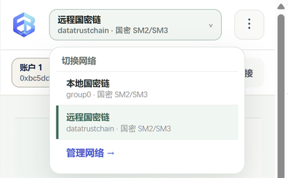
</div>

## 5. 管理账户

钱包可以从同一套助记词派生多个账户。不同账户拥有各自的地址和私钥，但都可以通过当前钱包的助记词恢复。

### 查看、复制和切换账户

1. 在钱包首页点击当前账户名称。
2. 在“切换账户”列表中查看已有账户。
3. 点击复制按钮可以复制对应账户的当前网络地址。
4. 点击其他账户即可将其设为当前账户。切换后，资产和活动记录也会随当前账户更新。
5. 点击“管理账户”进入账户管理页面。

<div style="max-width: 414px; margin: 0 auto;">
  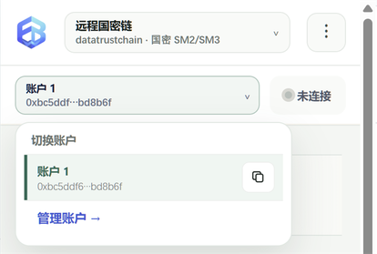
</div>

账户管理页面会显示账户名称、当前网络下的地址以及当前账户标记。列表中的复制按钮用于复制地址，右侧的 `•••` 按钮用于打开账户操作菜单。

<div style="max-width: 414px; margin: 0 auto;">
  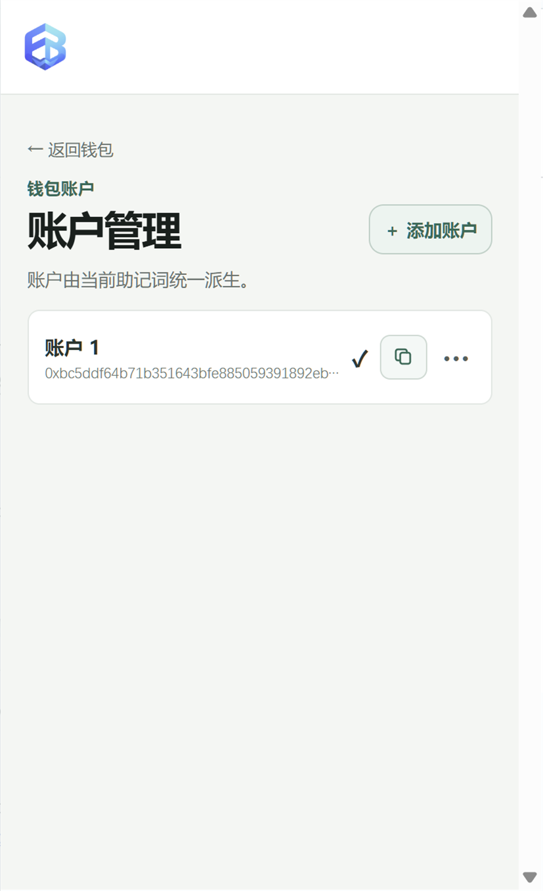
</div>

### 添加派生账户

1. 在账户管理页面点击“添加账户”。
2. 填写账户名称和可选备注。
3. 点击“添加账户”。钱包会使用下一个未使用的派生索引创建账户。

账户名称和备注只用于本地识别，不会改变账户地址或私钥。

<div style="max-width: 414px; margin: 0 auto;">
  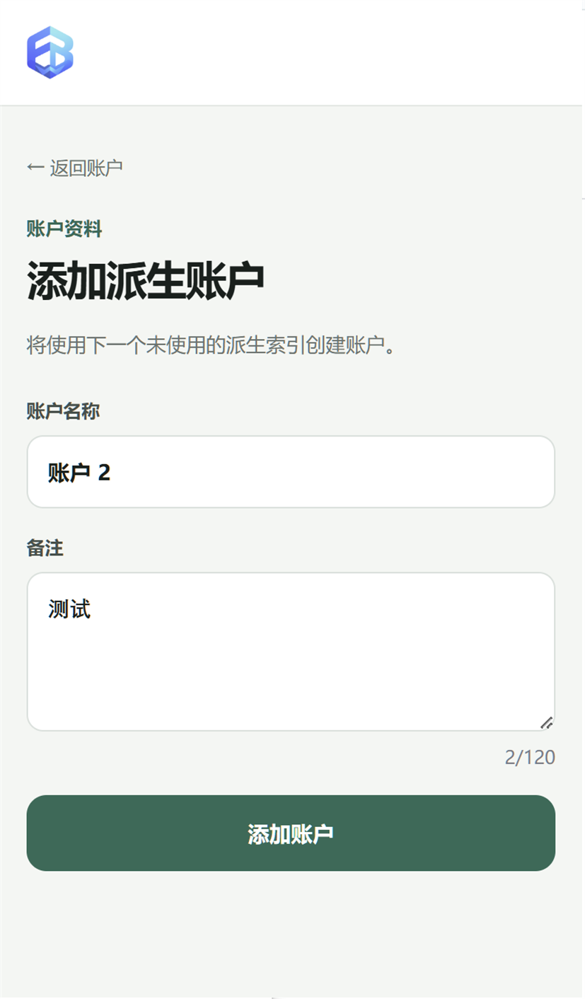
</div>

添加成功后，新账户会出现在账户列表中并成为当前账户。原账户仍然保留，可随时切换回来。

<div style="max-width: 414px; margin: 0 auto;">
  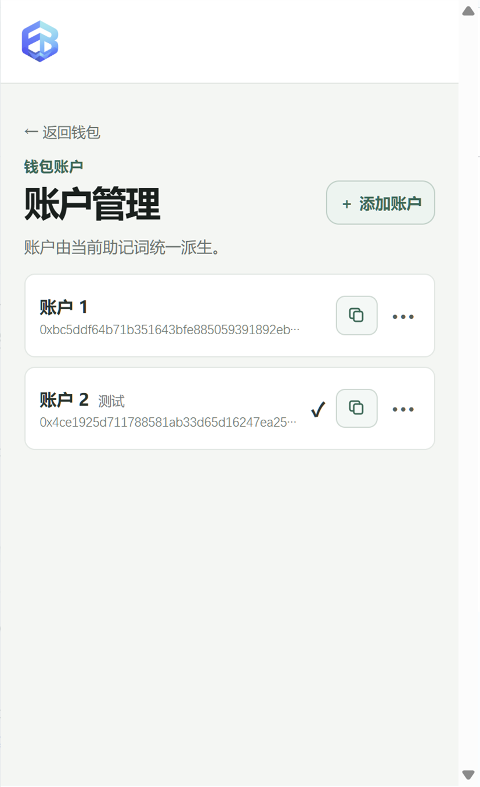
</div>

### 编辑或删除账户

点击账户右侧的 `•••` 按钮，可以执行以下操作：

- “导出私钥”：验证身份后临时显示该账户私钥；
- “编辑”：修改账户名称和备注，不会改变地址或私钥；
- “删除”：从本地账户列表中移除该派生账户。

钱包至少需要保留一个账户，因此只剩一个账户时不能删除。删除派生账户不会销毁链上资产；以后仍可使用同一助记词和派生索引重新恢复，但删除前应确认已经安全备份助记词。

<div style="max-width: 414px; margin: 0 auto;">
  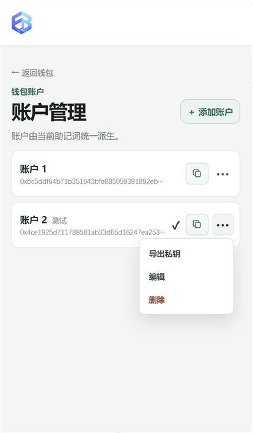
</div>

### 导出私钥

导出私钥属于高风险操作：

1. 在账户操作菜单中点击“导出私钥”。
2. 核对账户、派生路径和当前网络地址。
3. 勾选风险确认框。
4. 输入钱包密码，点击“验证并显示私钥”。

<div style="max-width: 414px; margin: 0 auto;">
  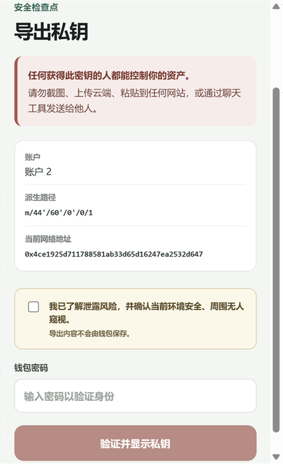
</div>

验证成功后，私钥只会在当前页面临时显示。需要使用时可以点击“复制”，使用完成后立即点击“完成并清除”，不要截图、上传云端、粘贴到网站或通过聊天工具发送。

<div style="max-width: 414px; margin: 0 auto;">
  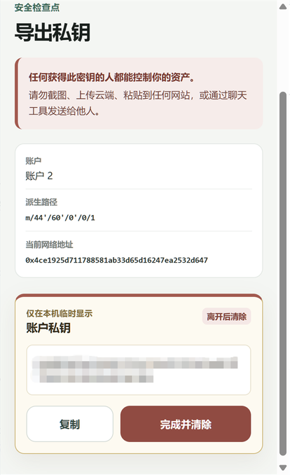
</div>

## 6. 管理资产

钱包首页的“资产”页用于查看当前账户在当前网络下的链余额、ERC20 代币和 ERC721 数字藏品。资产列表和账户、网络绑定：切换账户或切换网络后，页面会显示对应账户在该网络下的资产。

### 打开资产管理

1. 进入钱包首页。
2. 确认顶部已经选择目标网络和目标账户。
3. 在“资产”页点击“管理资产”。
4. 在弹出的“管理”窗口中添加、刷新、编辑或删除合约资产。


<div style="max-width: 414px; margin: 0 auto;">
  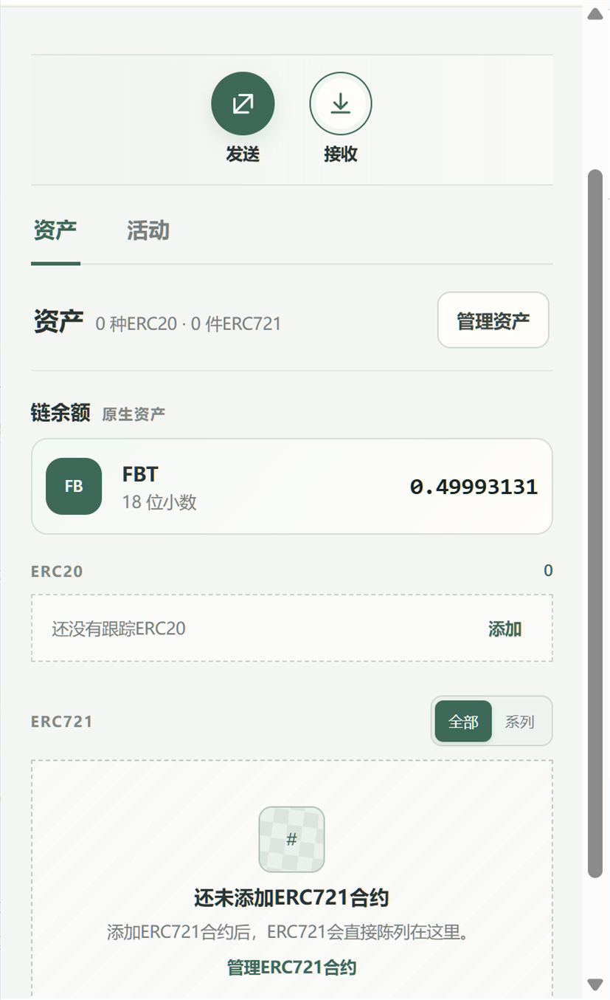
</div>

<div style="max-width: 414px; margin: 0 auto;">
  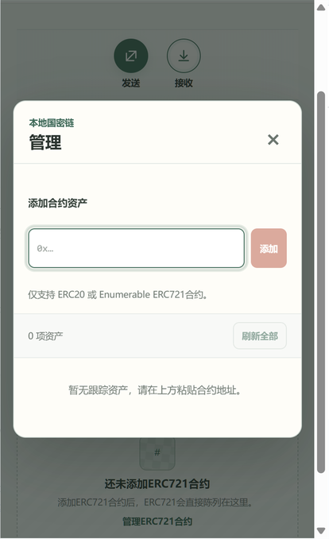
</div>

### 添加 ERC20 合约资产

在“添加合约资产”输入框中粘贴以下 ERC20 合约地址，然后点击“添加”：

钱包会读取合约信息并识别资产类型，添加成功后会显示资产名称、符号、合约地址和添加时间。


<div style="max-width: 414px; margin: 0 auto;">
  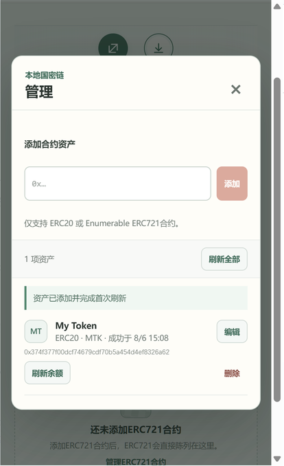
</div>

添加完成后，回到资产首页可以在 `ERC20` 区域看到该代币。页面会显示代币名称、符号和当前账户余额。


<div style="max-width: 414px; margin: 0 auto;">
  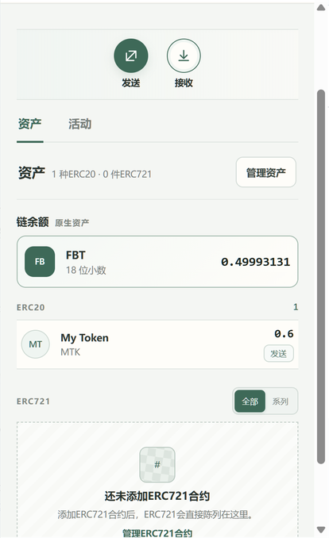
</div>

说明：
- 当前仅支持标准 ERC20 合约。
- 如果余额没有立即变化，可以在管理窗口点击“刷新余额”，或点击“刷新全部”。
- ERC20 余额按合约返回的小数位数展示。
- 如果 ERC20 余额为 `0`，如需演示余额或转账，请先向当前钱包账户发行 ERC20 资产，再点击“刷新余额”。

### 添加 ERC721 合约资产

在同一个“添加合约资产”输入框中粘贴以下 ERC721 合约地址，然后点击“添加”：

钱包支持 `Enumerable ERC721` 合约，添加成功后会在管理窗口中显示 NFT 合约信息。

<!-- 截图要求：资产管理窗口同时显示已添加的 ERC20 和 ERC721，以及两个指定合约地址。 -->
<div style="max-width: 414px; margin: 0 auto;">
  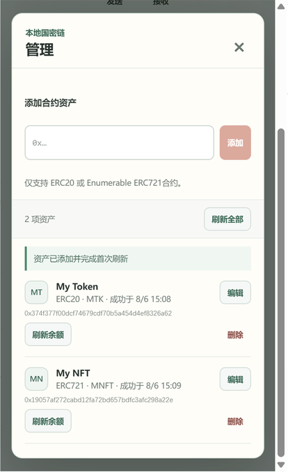
</div>

添加完成后，回到资产首页可以在 `ERC721` 区域查看该账户持有的 NFT。页面支持“全部”和“系列”两种查看方式：

- “全部”会直接展示当前账户持有的 NFT 卡片。
- “系列”会按 NFT 合约进行归类，便于资产较多时查看。


<div style="max-width: 414px; margin: 0 auto;">
  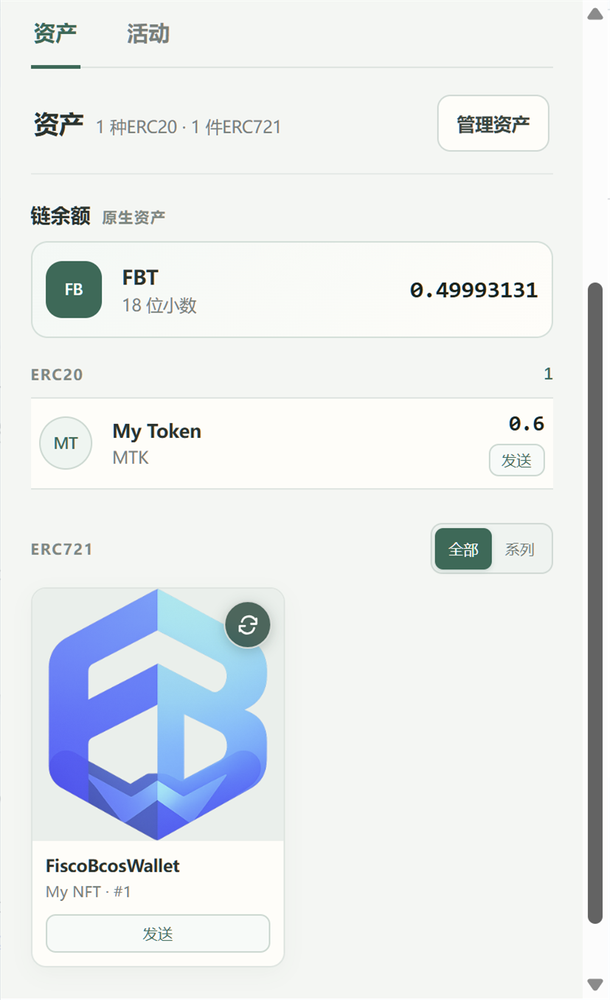
</div>

说明：
- 当前仅支持 Enumerable ERC721 合约。
- NFT 卡片会显示 Token ID、名称和所属合约信息。
- 如果刚添加合约后没有展示 NFT，可以点击卡片右上角刷新按钮，或在管理窗口点击“刷新全部”。
- 如果当前账户没有 NFT，请先向该账户发行 ERC721 资产，再返回钱包刷新；发行目标地址应与钱包顶部显示的当前账户一致。

### 编辑、刷新和删除资产

在资产管理窗口中，每个已添加资产都提供常用操作：

- “编辑”：修改资产在钱包中的显示信息。
- “刷新余额”：重新读取当前账户在该合约下的余额或 NFT 持有情况。
- “刷新全部”：一次性刷新所有已添加合约资产。
- “删除”：从钱包资产列表中移除该合约资产。

删除资产只会移除钱包本地的展示记录，不会影响链上资产，也不会转移或销毁代币。后续如需再次查看，可以重新添加合约地址。

## 7. 连接 DApp

DApp 页面会检测钱包注入的对象：

```js
window.fisco
```

连接流程：

1. 打开支持 FISCO BCOS Wallet 的 DApp。
2. 点击 DApp 页面中的“连接钱包”。
3. 钱包弹出授权窗口。
4. 查看请求来源和请求账户。
5. 选择允许授权的账户。
6. 点击确认。

授权成功后，DApp 可以读取已授权账户地址。


<div style="max-width: 414px; margin: 0 auto;">
  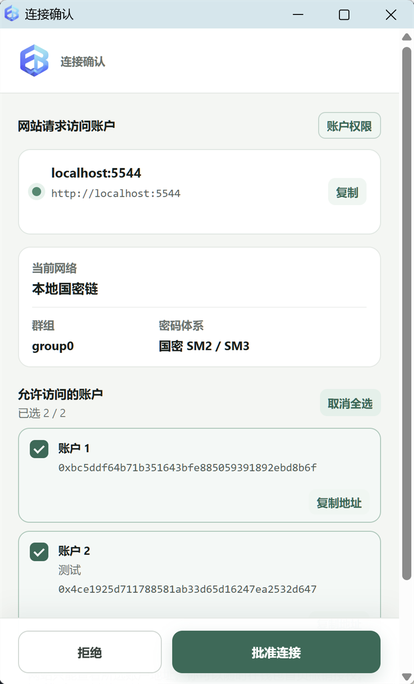
</div>

## 8. 读取链上信息

连接钱包后，DApp 可以通过钱包读取：

- 当前账户；
- 当前网络；
- 当前群组；
- Chain ID；
- 块高；
- 合约只读方法结果。

这些读取操作通常不需要交易确认。

## 9. 发送交易

当 DApp 发起写链操作时，钱包会弹出交易确认窗口。

用户需要核对：

- 请求来源；
- 当前网络；
- 当前账户；
- 目标合约地址；
- 调用数据；
- 风险提示。

确认无误后点击“确认”，钱包会在本地签名并发送交易。拒绝后，交易不会发送。


<div style="max-width: 414px; margin: 0 auto;">
  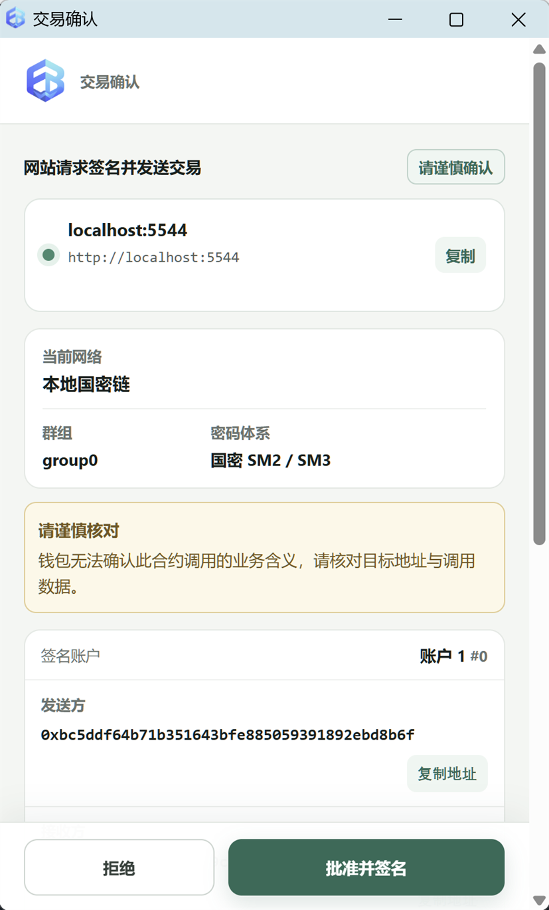
</div>

## 10. 站点授权管理

钱包会记录已授权的 DApp 站点。

用户可以在钱包中查看并撤销站点授权。撤销后，该站点需要重新请求连接钱包，才能再次读取账户。


<div style="max-width: 414px; margin: 0 auto;">
  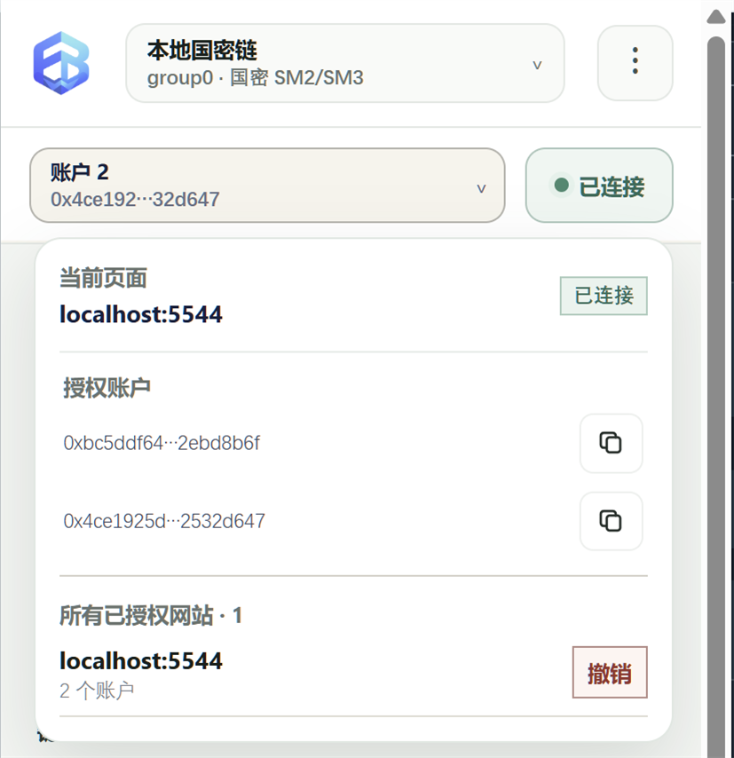
</div>

## 11. 常见问题

### 钱包未初始化

如果 DApp 提示：

```text
Wallet is not initialized
```

说明还没有创建或恢复钱包。先打开插件完成初始化。

### 未配置网络

如果提示：

```text
No active FISCO BCOS group is configured
```

说明钱包还没有添加网络，或当前没有选中可用网络。进入网络管理添加并切换网络。

### 网络连接失败

检查：

- RPC URL 是否正确；
- 群组 ID 是否正确；
- 密码体系是否和链一致；
- 网络服务是否可访问。

### 交易被拒绝

如果用户在确认窗口点击拒绝，DApp 会收到用户拒绝错误。这是正常行为。

### 添加合约资产失败

检查合约地址是否正确，并确认该合约是否为钱包当前支持的 ERC20 或 Enumerable ERC721 合约。还需要确认当前网络、群组 ID 和密码体系与合约所在链一致。

### 方法不支持

如果 DApp 调用了钱包暂不支持的方法，可能看到：

```text
Unsupported method
```

DApp 应使用钱包已支持的接口。

## 12. DApp 接入示例

检测钱包：

```js
if (!window.fisco?.isFiscoWallet) {
  throw new Error("请先安装 FISCO BCOS Wallet");
}
```

请求连接：

```js
const accounts = await window.fisco.request({
  method: "eth_requestAccounts",
  params: [],
});
```

读取账户：

```js
const accounts = await window.fisco.request({
  method: "eth_accounts",
  params: [],
});
```

读取块高：

```js
const blockNumber = await window.fisco.request({
  method: "eth_blockNumber",
  params: [],
});
```

读取并切换原生 RPC 群组：

```js
const currentGroupId = await window.fisco.request({
  method: "wallet_getGroup",
  params: [],
});

await window.fisco.request({
  method: "wallet_switchGroup",
  params: [{ groupId: "testchain" }],
});
```

`wallet_switchGroup` 只用于原生 RPC 网络。目标群组必须已经添加到钱包；切换前钱包会弹出确认窗口，只有用户批准后才会更改当前网络。

读取并切换 Chain ID：

```js
const currentChainId = await window.fisco.request({
  method: "eth_chainId",
  params: [],
});

await window.fisco.request({
  method: "wallet_switchEthereumChain",
  params: [{ chainId: "0x4ee8" }],
});
```

`wallet_switchEthereumChain` 的 `chainId` 必须是 `0x` 开头的十六进制数量，例如十进制 `20200` 对应 `0x4ee8`。目标 Chain ID 必须已经配置在钱包中且只能匹配一个网络；否则钱包会返回未识别或配置歧义错误。切换同样需要用户确认。

发送交易：

```js
const txHash = await window.fisco.request({
  method: "eth_sendTransaction",
  params: [
    {
      from: accounts[0],
      to: "0x...",
      data: "0x...",
    },
  ],
});
```
